# Physarum

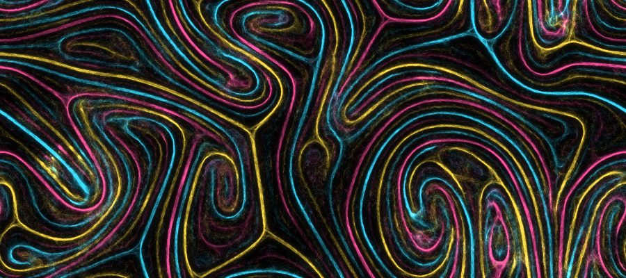

## A mini tutorial: the slime mould that solves problems

### Meet *Physarum polycephalum*

*Physarum polycephalum*, the "many-headed slime", is a **slime mould**. Despite the name, it
is not a fungus. It belongs to the Amoebozoa, single-celled organisms that are neither
plants, animals nor fungi. It lives on the forest floor and on decaying wood, where it eats
bacteria and fungal spores. In the lab it is happy with oat flakes.

Its main life stage, the *plasmodium*, is remarkable in three ways:

* **It is one single, enormous cell.** The bright yellow blob can grow to many centimetres
  across, yet it is one cell with millions of nuclei, and no membranes separate them.
* **Its body is a network of tubes.** Protoplasm sloshes back and forth through the tubes in
  a rhythm of a minute or two ("shuttle streaming"), carrying nutrients and signals around.
* **The network adapts.** Tubes that carry a lot of flow grow thicker. Tubes that carry
  little shrink and eventually disappear. Chemical traces guide where new tubes grow:
  attractants from food pull it in, and it avoids places it has already explored.

It has no brain and no neurons, yet this simple feedback lets it solve real problems:

* **Mazes.** In 2000 Toshiyuki Nakagaki and colleagues filled a maze with plasmodium and put
  oat flakes at the entrance and the exit. Within hours the mould had withdrawn from all dead
  ends. The tube that remained ran along the shortest route
  (*Nature* 407, 470).
* **Rail networks.** In 2010 Atsushi Tero and colleagues placed oat flakes in the pattern of
  the cities around Tokyo, using bright light (which the mould avoids) to mark mountains and
  sea. The network the mould grew was comparable to the real Tokyo rail system in
  efficiency, fault tolerance and cost (*Science* 327, 439).

This paclet lets you grow such networks in the computer, using two classic models that
capture two different sides of the organism.

### Model 1: many simple agents (how the network *forms*)

Jeff Jones (2010) showed that a crowd of simple "particles of plasmodium" produces
Physarum-like networks. Every agent repeats the same four steps:

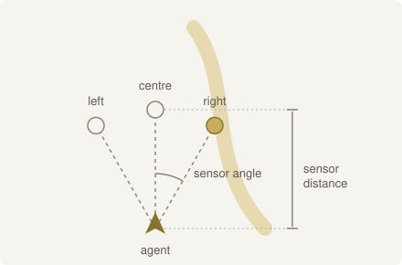

| 1. Sense | 2. Rotate | 3. Move | 4. Deposit |
| :---: | :---: | :---: | :---: |
| 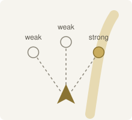 | 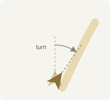 | 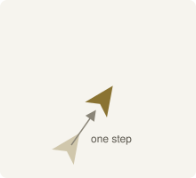 | 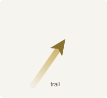 |
| Smell the trail at three sensors ahead. | Turn towards the strongest smell. | Take one step forward. | Leave a little trail behind. |

Then the whole trail map diffuses and decays.

Nobody tells the agents to build a network. Trails attract agents, and agents lay more trail:
that **positive feedback** turns random motion into structure. Load the paclet (see
[*Getting started*](#getting-started) below) and watch it happen:

```wolfram
SeedRandom[1];
sim = PhysarumSimulation["Classic", "Size" -> 220];
states = FoldList[PhysarumEvolve, sim, {2, 8, 40, 300}];   (* steps 2, 10, 50, 350 *)
PhysarumImage /@ Rest[states]
```


**What you are looking at.** The four pictures are the same simulation after 2, 10, 50 and
350 steps (`FoldList` keeps every intermediate state). There is no food in this example. The
simulation starts with agents scattered at random over a 220×220 grid, and they have nothing
to steer by except each other.

**What is an agent?** An agent is a point-sized virtual particle, and it is not a piece of a
real cell. The model does not simulate the plasmodium's tubes or nuclei. Instead it treats the
mould as a crowd of "particles of plasmodium" (Jones's term), each so simple that on its own it
only wanders and follows smells. Only the crowd, through its shared trail, behaves like the
mould. You can read one agent as a small patch of protoplasm, and the trail as the
chemical signal that patches leave in their surroundings. The crowd's strands, not any
single agent, correspond to the mould's veins.

**How is the number of agents determined?** The number of agents is chosen as a fraction of the grid
area. The "Classic" preset uses an `"AgentDensity"` of 0.3 agents per pixel, so a 220×220
grid (48,400 pixels) gets 0.3 × 48,400 = 14,520 agents, and a larger `"Size"` gets
proportionally more. To use a different number, set an exact count with the `"Agents"`
option (or give your own species specification an `"AgentDensity"`):

```wolfram
PhysarumSimulation["Classic", "Size" -> 220, "Agents" -> 5000]
```

The pictures do not draw the agents themselves, which would be a haze of tiny dots. They
show the **trail map**: the amount of chemical trail on every pixel, which is what the agents
sense and what they add to. Black means no trail, and the colours run from purple through
orange to pale yellow as the trail gets stronger. Bright strands are therefore places that
many agents travel along, which is the closest thing to the mould's body in this picture. The
darker haze around them is faint trail that is still fading.

At first the trail is noise. Within a few dozen steps, little streams merge into strands.
Over hundreds of steps, small loops dissolve and the survivors thicken, just as a real
plasmodium coarsens its network over time.

Food does not appear until the *Foraging* example below, where `"ShowFood" -> True` draws the
food sources on top of the trail map.

**How agents steer.** Two numbers from the agent picture above decide what pattern the crowd
makes:

* the *sensor angle*: how far apart the three sensors point (the arc in the picture),
* the *rotation angle*: how sharply an agent turns towards the sensor that smells strongest.

Each line of code below grows one simulation with its own pair of angles. `PhysarumArt` takes
a *species* (an Association of agent parameters) in place of a preset name, and grows and
draws it in one call. Only the two angles are given. Everything else (sensor distance 9,
decay 0.1, and so on) is left at its default and is the same in all three runs, so any
difference between the pictures comes from the angles alone. Angles are in radians, hence
`Degree`. All three runs use the same grid size and number of steps, and the same color
scheme, which is only there to make the pictures easier to compare.

```wolfram
PhysarumArt[<|"SensorAngle" -> 22.5 Degree, "RotationAngle" -> 45 Degree|>, "Size" -> 220, "Steps" -> 400, ColorFunction -> "SunsetColors"]
PhysarumArt[<|"SensorAngle" -> 22.5 Degree, "RotationAngle" -> 90 Degree|>, "Size" -> 220, "Steps" -> 400, ColorFunction -> "SunsetColors"]
PhysarumArt[<|"SensorAngle" -> 90 Degree, "RotationAngle" -> 11.25 Degree|>, "Size" -> 220, "Steps" -> 400, ColorFunction -> "SunsetColors"]
```

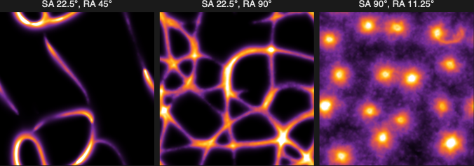

The three pictures, left to right (labelled SA for sensor angle and RA for rotation angle):

1. **SA 22.5°, RA 45°** (the defaults). The sensors look almost straight ahead and the turns
   are moderate, so agents follow long, smooth curves and gather into a few strong strands.
2. **SA 22.5°, RA 90°.** The sensors are the same, but agents turn sharply. They swing onto
   any trail they touch and cross it again and again, which builds a dense web of many
   junctions. This is the `"Mesh"` preset.
3. **SA 90°, RA 11.25°.** The outer sensors look sideways, and the turns are gentle. Instead of
   strands, the agents settle into isolated round clumps, like the spots of a leopard. This is
   the `"Leopard"` preset.

**How far agents look.** The *sensor distance* sets the scale of the network. Short-sighted
agents build fine, tight meshes. Far-sighted agents build coarse, fibrous highways:

```wolfram
Table[
  PhysarumArt[<|"SensorDistance" -> so, "Diffusion" -> 0.1, "Decay" -> 0.3, "Deposit" -> 1,
    "SensorAngle" -> 30 Degree, "RotationAngle" -> 30 Degree|>, "Size" -> 220, "Steps" -> 400, "Agents" -> 30000],
  {so, {4, 12, 30}}]
```

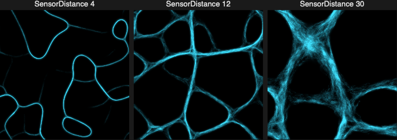

**Memory.** The trail is the mould's external memory. The *decay* rate says how quickly it
forgets. With slow decay, old trails linger, and the network is smooth and slow to change.
With fast decay, only constantly used paths survive, and the network is fine and restless:

```wolfram
Table[PhysarumArt[<|"Decay" -> dc, "SensorDistance" -> 9|>, "Size" -> 220, "Steps" -> 400,
  ColorFunction -> "SunsetColors"], {dc, {0.02, 0.1, 0.4}}]
```

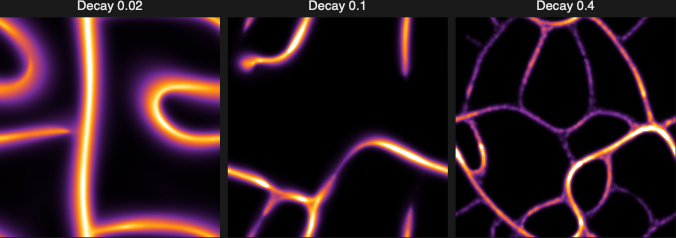

**Foraging.** Food releases attractant. Add food sources and the random network reorganizes
into a transport network that links them. Strands that connect food are reinforced, and the
rest fade away:

```wolfram
SeedRandom[5];
food = RandomReal[{0.15, 0.85}, {9, 2}];                     (* positions in the unit square *)
sim = PhysarumSimulation["Classic", "Size" -> 220, "Food" -> food, "FoodStrength" -> 50];
PhysarumImage[#, "ShowFood" -> True] & /@ Rest[FoldList[PhysarumEvolve, sim, {30, 170, 800}]]
```

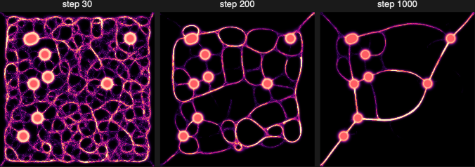

**Competition.** Give two populations their own trails. With `"Repulsion"`, each avoids the
other's trail, as two plasmodia avoid each other's slime. Without it they interpenetrate.
With it they split space into separate territories, and at strong repulsion into
interleaved lanes:

```wolfram
Table[
  PhysarumArt[<|"Species" -> Table[<|"SensorDistance" -> 12, "Diffusion" -> 0.1, "Decay" -> 0.3,
      "Deposit" -> 1, "SensorAngle" -> 30 Degree, "RotationAngle" -> 30 Degree, "Repulsion" -> r|>, 2],
    "AgentDensity" -> 1|>, "Size" -> 220, "Steps" -> 500],
  {r, {0, 1, 3}}]
```

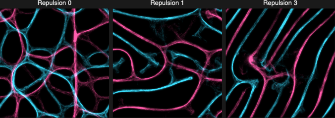

### Model 2: tubes and flow (how the network *optimizes*)

The agent model explains how networks form, but it has no notion of flow, and flow is what
makes the real mould so good at shortest paths. Tero and colleagues (2007) modelled the
plasmodium as a network of tubes and applied the same rule over and over:

1. Food at one place pumps protoplasm in, and food elsewhere drains it. Like electric
   current in a circuit, the flow splits over all tubes according to their conductivity.
2. **Tubes that carry more flow become thicker (more conductive). Tubes that carry little
   wither.**

That is all. `PhysarumFlow` implements this model: each step is one linear solve on the
tube network.

**Solving a maze.** Fill a maze with tubes, put food at the entrance and exit, and let the
flow decide. (`"Loops"` opens extra walls, so there are several competing routes.)

```wolfram
maze = PhysarumMaze[10, "Loops" -> 8, RandomSeeding -> 3];
frames = PhysarumFlow[maze, {{0.05, 0.95}, {0.95, 0.05}}, "Output" -> "Frames"];
{maze, frames[[2]], frames[[8]], Last[frames]}
```

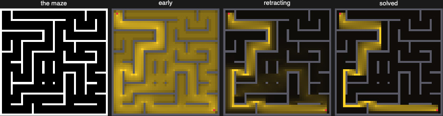

In the beginning the whole maze carries flow. Dead ends carry none and fade almost at once.
The competing routes then fight: the longer ones carry a little less flow, so they thin a
little, which gives them even less flow. That runaway effect leaves only the shortest route,
the same result Nakagaki saw in the real organism.

**Building a transport network.** With many food sources, each step picks one source at
random to pump and lets all the others drain. The mould then has to serve everyone.
`"Flux"` sets how much protoplasm flows. Low flux gives a lean, tree-like network: cheap,
but one broken tube cuts it in two. High flux keeps extra cross-links: more tube, but more
robust. That is the trade-off Tero *et al.* measured in their Tokyo experiment.

```wolfram
SeedRandom[7]; pts = RandomReal[1, {14, 2}];
Table[PhysarumFlow[pts, "Flux" -> f, "Resolution" -> 80, RandomSeeding -> 1], {f, {1, 4, 16}}]
```

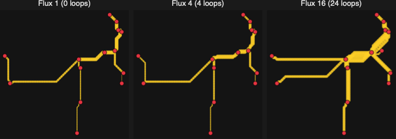

### What each model captures

| Biology | Agent model (`PhysarumSimulation`) | Flow model (`PhysarumFlow`) |
| --- | --- | --- |
| plasmodium | ~10⁵ agents | a network of tubes |
| chemical traces | the trail map (deposit, diffuse, decay) | not modelled |
| food | attractant sources (`"Food"`) | pumps and drains of protoplasm |
| light, obstacles | `"Walls"` | walls of the maze / missing tubes |
| tube growth | strands that attract more agents | conductivity grows with flow |
| outcome | network *formation*, patterns, foraging | shortest paths, efficient networks |

Want to go further? The sections below cover every function. `PhysarumNetwork` extracts
the agent model's network as a `Graph` (even on a map), and `PhysarumAnimate` turns any
simulation into a video.

**References**
* T. Nakagaki, H. Yamada, Á. Tóth, "Maze-solving by an amoeboid organism", *Nature* 407, 470 (2000).
* A. Tero, R. Kobayashi, T. Nakagaki, "A mathematical model for adaptive transport network in
  path finding by true slime mold", *J. Theor. Biol.* 244, 553 (2007).
* J. Jones, "Characteristics of pattern formation and evolution in approximations of Physarum
  transport networks", *Artificial Life* 16, 127 (2010).
* A. Tero *et al.*, "Rules for biologically inspired adaptive network design", *Science* 327, 439 (2010).

---

## Physarum in the Wolfram Language

The `ArnoudBuzing/Physarum` paclet brings both models to the Wolfram Language. Hundreds of
thousands of simple agents follow each other's chemical trails, and glowing, vein-like
transport networks emerge. The agent model adds multiple competing species, food sources and
walls to Jones's original. The flow model turns food sources into shortest paths and
efficient networks.

| Function | What it does |
| --- | --- |
| `PhysarumArt` | grow and render an agent simulation in one call |
| `PhysarumSimulation`, `PhysarumEvolve`, `PhysarumImage` | set up, advance and draw an agent simulation step by step |
| `PhysarumAnimate` | turn a simulation into an animation or a video |
| `PhysarumNetwork` | grow a mould between food sources and read it off as a `Graph` (also on a map) |
| `PhysarumFlow` | tube-and-flow model: shortest paths and adaptive transport networks |
| `PhysarumMaze` | generate a maze for the flow model to solve |
| `$PhysarumPresets` | named parameter sets ("Classic", "Marble", "Rivals", …) |

### Getting started

Load the paclet:

```wolfram
PacletDirectoryLoad["/path/to/physarum/Physarum"];
Needs["ArnoudBuzing`Physarum`"]
```

See [BUILD.md](BUILD.md) for requirements and how to build the paclet.

## Quick start

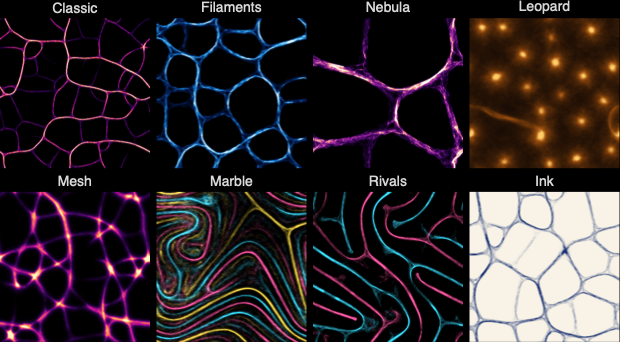

```wolfram
(* one-shot: grow and render *)
PhysarumArt[]

(* the named presets *)
Keys[$PhysarumPresets]
(* {"Classic", "Filaments", "Nebula", "Leopard", "Mesh", "Marble", "Rivals", "Ink"} *)

PhysarumArt["Filaments"]
PhysarumArt["Marble", "Size" -> 768]
```

## Step by step

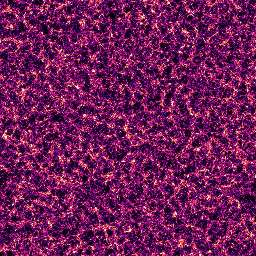

```wolfram
sim = PhysarumSimulation["Classic", "Size" -> 512];   (* a PhysarumSimulationObject *)
sim = PhysarumEvolve[sim, 400];                        (* advance 400 steps *)
PhysarumImage[sim]

sim["Step"]          (* 400 *)
sim["AgentCount"]
sim["Trail"]         (* {species, h, w} array of chemo-attractant *)
sim["Properties"]
```

Rendering options for `PhysarumImage` (and `PhysarumArt`):

```wolfram
PhysarumImage[sim, ColorFunction -> "SunsetColors"]
PhysarumImage[sim, ColorFunction -> None, "Colors" -> {Cyan}, Background -> Black]
PhysarumImage[sim, "Glow" -> 0.6, "Gamma" -> 0.5]
PhysarumImage[sim, Background -> White, "Colors" -> {Darker[Blue]}, "Glow" -> 0]  (* ink on paper *)
```

## Your own species

A species is an Association. Unspecified keys use the defaults. Angles are in radians,
so use `Degree`.

```wolfram
PhysarumArt[<|
  "SensorAngle"    -> 30 Degree,   (* angle between the three forward sensors *)
  "SensorDistance" -> 12,          (* how far ahead agents sense, in pixels   *)
  "RotationAngle"  -> 30 Degree,   (* how sharply agents turn                 *)
  "StepSize"       -> 1,
  "Deposit"        -> 1,           (* trail laid per step                     *)
  "Decay"          -> 0.3,         (* fraction of trail lost per step         *)
  "Diffusion"      -> 0.1,         (* 0 = no blur, 1 = full 3x3 blur per step *)
  "Jitter"         -> 0            (* random wiggle added to the heading      *)
|>, "Steps" -> 500]
```

Multiple species: give a list. `"Repulsion"` makes each species avoid the others' trails.

```wolfram
PhysarumArt[<|
  "Species" -> {
    <|"SensorDistance" -> 12, "Diffusion" -> 0.1, "Decay" -> 0.3, "Deposit" -> 1, "Repulsion" -> 2, "Color" -> Orange|>,
    <|"SensorDistance" -> 25, "Diffusion" -> 0.1, "Decay" -> 0.3, "Deposit" -> 1, "Repulsion" -> 2, "Color" -> Cyan, "Fraction" -> 2|>
  },
  "AgentDensity" -> 1
|>, "Steps" -> 600]
```

Some parameter regimes worth exploring:

| Look | Parameters |
| --- | --- |
| fine mesh | `SensorDistance` 6, `Diffusion` 0.1, `Decay` 0.3 |
| fibrous cells | `SensorDistance` 15–30, `Diffusion` 0.1 |
| leopard spots | `SensorAngle` 90°, `RotationAngle` 11.25° |
| dense web | `SensorAngle` 22.5°, `RotationAngle` 90° |
| thick loops | defaults (`Decay` 0.1, `Diffusion` 1) |

## Initialization, food and walls

```wolfram
(* start the agents in a shape: "Random", "Disk", "Ring", "Burst", "Food", or any String/Graphics/Image *)
PhysarumArt["Classic", "Initialization" -> "Disk", "Wrap" -> False, "Steps" -> 200]

(* food: agents are drawn to it. Points in the unit square, or text/graphics/images *)
PhysarumArt["Filaments", "Food" -> "PHYSARUM", "FoodStrength" -> 5, "Initialization" -> "Food", "Size" -> {768, 256}]

PhysarumArt["Classic", "Food" -> RandomReal[1, {12, 2}], "FoodStrength" -> 50, "ShowFood" -> True]

(* walls: anything maskable; agents cannot enter them *)
PhysarumArt["Classic", "Walls" -> Graphics[{Disk[{0, 0}, 0.3], Disk[{0.6, 0.5}, 0.15]}, PlotRange -> {{-1, 1}, {-1, 1}}]]
```

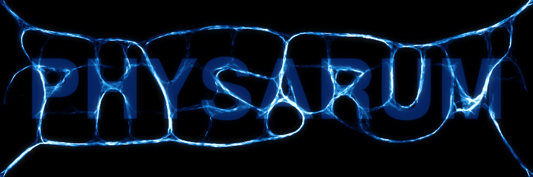

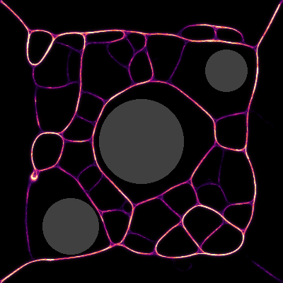

## Animation

```wolfram
frames = PhysarumAnimate["Classic", 60, 10];               (* 60 frames, 10 steps each *)
ListAnimate[frames]

PhysarumAnimate[PhysarumSimulation["Marble", "Size" -> 384], 120, 5, "Output" -> "Video"]
```

## Transport networks → `Graph`

`PhysarumNetwork` works like the famous slime-mould experiments. It puts food at the given
points, lets the mould grow between them, then reads the result off as a `Graph`:

1. threshold the trail map (gamma-compressed so faint filaments survive), thin it to a skeleton;
2. collapse junction pixel clusters into single nodes, and walk the pixel chains between them.
   Resampling every few pixels keeps the edges curved;
3. attach each food source to its nearest network vertex, and delete dead ends that lead to
   no food.

The graph carries `VertexCoordinates` (in your coordinates) and Euclidean `EdgeWeight`s.
Food sources are the vertices `"Food1"`, `"Food2"`, … (or the original `Entity` for
entity input).

```wolfram
pts = RandomReal[1, {14, 2}];
g = PhysarumNetwork[pts]

PhysarumNetwork[pts, "Output" -> "Image"]         (* the grown mould, food highlighted *)
PhysarumNetwork[pts, "Output" -> "Association"]   (* Graph, Simulation, Image, Skeleton, Food *)
PhysarumNetwork[pts, "Backbone" -> True]          (* only edges on shortest food-to-food paths *)

(* compare the mould with the minimum spanning tree *)
FindSpanningTree[PhysarumNetwork[pts, "Backbone" -> True]]
```

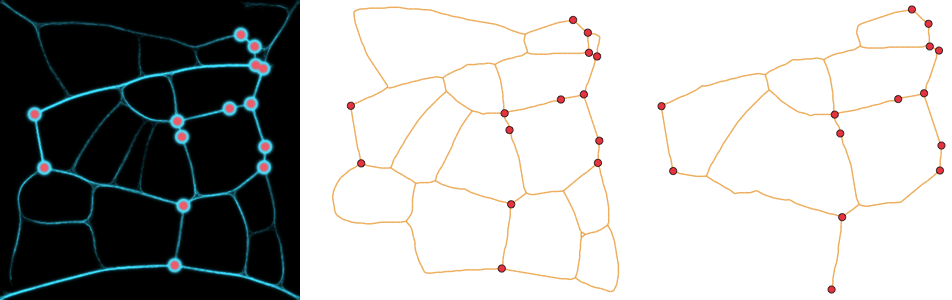

Useful options: `"Size"` (grid resolution, default 400), `"Steps"` (2000),
`"AgentDensity"` (0.3), `"FoodStrength"` (300), `"Walls"`, `"Species"`, and
`"DeleteDeadEnds"` / `"Backbone"`.

### Geographic networks

Give `GeoPosition`s or entities with a position (cities, airports, landmarks, …), and use
`"Output" -> "GeoGraphics"`. Entities are resolved with one batched `EntityValue[..., "Position"]`
lookup, and the graph's food vertices are the entities themselves:

```wolfram
cities = Entity["City", #] & /@ {
  {"Amsterdam", "NoordHolland", "Netherlands"}, {"Rotterdam", "ZuidHolland", "Netherlands"},
  {"TheHague", "ZuidHolland", "Netherlands"}, {"Utrecht", "Utrecht", "Netherlands"},
  {"Eindhoven", "NoordBrabant", "Netherlands"}, {"Groningen", "Groningen", "Netherlands"},
  {"Zwolle", "Overijssel", "Netherlands"}, {"Maastricht", "Limburg", "Netherlands"}};

PhysarumNetwork[cities, "Output" -> "GeoGraphics", "Backbone" -> True]

g = PhysarumNetwork[cities, "Backbone" -> True];
GraphDistance[g, cities[[1]], cities[[8]]]   (* hops along the mould from Amsterdam to Maastricht *)
```

Here is a network for the 15 largest Dutch cities:

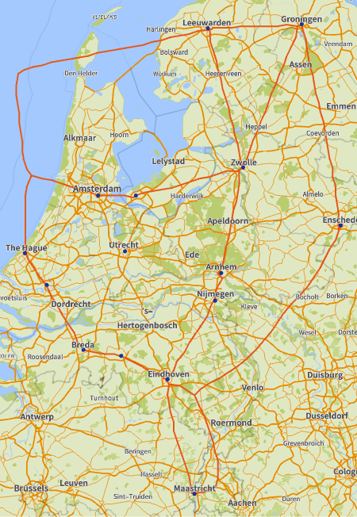

The mould knows nothing about water: pass a land/sea mask as `"Walls"` for a more
realistic network. Occasionally a food source ends up with no strand to it (the
graph is then not connected); a larger `"Steps"` or `"FoodStrength"` usually fixes that.

## Flow networks: `PhysarumFlow` and `PhysarumMaze`

The tube-and-flow model (Tero *et al.* 2007/2010): each step solves for the flow Q through
the tubes (like currents in a circuit), then updates the conductivity of every tube with
dD/dt = f(|Q|) − D.

```wolfram
maze = PhysarumMaze[12, "Loops" -> 10, "CellSize" -> 5, "WallWidth" -> 1, RandomSeeding -> 1];
PhysarumFlow[maze, {{0.05, 0.95}, {0.95, 0.05}}]                 (* Image of the solved maze *)
PhysarumFlow[maze, {{0.05, 0.95}, {0.95, 0.05}}, "Output" -> "Frames"]

PhysarumFlow[RandomReal[1, {12, 2}]]                             (* network on a lattice, as Graph *)
PhysarumFlow[GridGraph[{15, 15}], {1, 225}]                      (* any Graph, food at vertices *)
```

Options: `"Steps"` (Automatic: 200 for two food sources, 600 for more), `"Flux"` (2),
`"Exponent"` (Automatic: f(Q) = |Q| for two food sources, otherwise |Q|^1.8/(1+|Q|^1.8)),
`"TimeStep"` (0.3), `"Threshold"` (0.01, relative conductivity below which tubes are
dropped), `"Resolution"` (lattice size for point input, 50), `"Output"` (`"Image"`/`"Graph"`,
`"Frames"`, `"History"`, `"Conductivity"`), `ImageSize` and `RandomSeeding`. Graph output
keeps the conductivity of every tube as the edge property `"Conductivity"`.

## Function reference

Every function has its own reference page with syntax, options, notes and examples. Start at
the [function reference](docs/README.md).

## Building and contributing

Build instructions, the project layout, tests and performance notes are in [BUILD.md](BUILD.md).

## License

MIT
