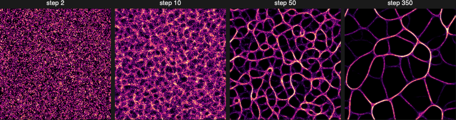

# PhysarumEvolve

Advances a simulation by a number of steps.

## Syntax

| Form | Meaning |
| --- | --- |
| `PhysarumEvolve[sim, n]` | advances the [PhysarumSimulationObject](PhysarumSimulationObject.md) `sim` by `n` steps and returns the new object |
| `PhysarumEvolve[sim]` | advances by a single step |
| `PhysarumEvolve[sim3D, n]` | advances a 3D [PhysarumSimulation3DObject](PhysarumSimulation3DObject.md) by `n` steps |

## Details

* One **step** does the following for every agent, in this order:
  1. *sense*: read the trail at three sensors ahead of the agent (left, centre and right, at
     `"SensorDistance"` and `"SensorAngle"`),
  2. *rotate*: turn by `"RotationAngle"` towards the strongest reading. If the centre sensor is
     the strongest, the agent goes straight on. If the centre is weaker than both side sensors,
     the agent turns left or right at random,
  3. *move*: take a step of length `"StepSize"` (after adding the random `"Jitter"` to the heading),
  4. *deposit*: add `"Deposit"` to the trail at the new position.

  Then the whole trail map *diffuses* (`"Diffusion"`), *decays* (`"Decay"`), and receives the food
  attractant. Food attracts every species.
* A 3D simulation follows the same steps in a volume. It senses with one sensor ahead and a ring of
  four tilted ones, and diffuses over 3 × 3 × 3 voxels. See
  [PhysarumSimulation3D](PhysarumSimulation3D.md) for details.
* `sim` is not changed. The new object has `"Step"` increased by `n`.
* `n` must be a non-negative integer. `PhysarumEvolve[sim, 0]` returns the state unchanged.
* Evolving in several calls gives the same kind of result as evolving in one, so
  `PhysarumEvolve[PhysarumEvolve[sim, 100], 200]` is comparable to `PhysarumEvolve[sim, 300]`. The
  runs are not identical, because every call draws a fresh random seed.
* The random numbers come from the kernel's generator. Call `SeedRandom[n]` before creating and
  evolving a simulation to get a repeatable result.
* The work happens in compiled code and uses all cores. The evaluation can be aborted in the
  usual way. An aborted evolve gives a `PhysarumEvolve::abort` message and returns `$Aborted`.
* On a grid that wraps, agents that leave one side come back on the opposite side. On a grid that
  does not wrap, and at walls, an agent that would step into the edge or a wall stays where it is,
  picks a new random heading, and does not deposit trail in that step. Sensors cannot see through
  walls.

## Examples

### Grow a simulation

```wolfram
sim = PhysarumSimulation["Classic", "Size" -> 220];
sim = PhysarumEvolve[sim, 300];
sim["Step"]                (* 300 *)
PhysarumImage[sim]
```

### One step at a time

```wolfram
sim = PhysarumSimulation["Classic", "Size" -> 100];
PhysarumEvolve[sim]["Step"]        (* 1 *)
```

### The original is unchanged

```wolfram
sim = PhysarumSimulation["Classic", "Size" -> 100];
later = PhysarumEvolve[sim, 50];
{sim["Step"], later["Step"]}       (* {0, 50} *)
```

### Take snapshots along the way

`FoldList` with `PhysarumEvolve` applies each number of steps in turn, so this gives the
simulation at steps 2, 10, 50 and 350:

```wolfram
SeedRandom[1];
sim = PhysarumSimulation["Classic", "Size" -> 220];
states = FoldList[PhysarumEvolve, sim, {2, 8, 40, 300}];
PhysarumImage /@ Rest[states]
```



### Repeatable results

```wolfram
SeedRandom[42];
a = PhysarumEvolve[PhysarumSimulation["Classic", "Size" -> 60], 20];
SeedRandom[42];
b = PhysarumEvolve[PhysarumSimulation["Classic", "Size" -> 60], 20];
a["Trail"] == b["Trail"]        (* True *)
```

### Change something part-way through

Because a simulation is an ordinary value, you can also stop, look, and continue. For example,
watch how much trail there is over time:

```wolfram
sim = PhysarumSimulation["Classic", "Size" -> 150];
totals = Table[Total[(sim = PhysarumEvolve[sim, 10])["Trail"], 3], {30}];
ListLinePlot[totals, AxesLabel -> {"10-step blocks", "total trail"}]
```

## Messages

| Message | Cause |
| --- | --- |
| `PhysarumEvolve::abort` | the evolution was aborted |
| `PhysarumSimulation::nolib` | the compiled simulation library was not found. See [BUILD.md](../BUILD.md). |

## See also

[PhysarumSimulation](PhysarumSimulation.md) ·
[PhysarumImage](PhysarumImage.md) ·
[PhysarumAnimate](PhysarumAnimate.md) ·
[PhysarumArt](PhysarumArt.md)
