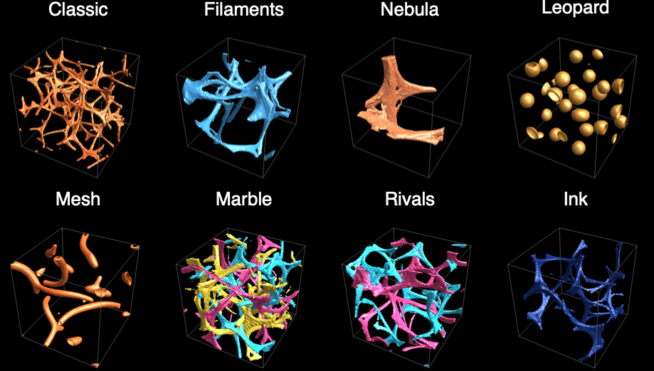

# PhysarumGraphics3D

Renders a 3D simulation as `Graphics3D`: the network as a smooth surface, or the agents as a point
cloud.

## Syntax

| Form | Meaning |
| --- | --- |
| `PhysarumGraphics3D[sim]` | the network of the [PhysarumSimulation3DObject](PhysarumSimulation3DObject.md) `sim` as a surface |
| `PhysarumGraphics3D[sim, Method -> "Points"]` | the agents as a point cloud |
| `PhysarumGraphics3D[sim, opts]` | with options |

## Details

* **`Method -> "Surface"`** (the default) draws, for each species, the surface where the normalized
  trail equals `"Threshold"`. The trail is blurred by `"Smoothing"` first. Raise the threshold for
  thinner strands, lower it for thicker ones.
* **`Method -> "Points"`** draws up to `"MaxPoints"` agents (a random sample if there are more),
  coloured by species, and brighter where the trail is strong. It is the fastest view.
* Coordinates are grid units: the plot range is `{{0, w}, {0, h}, {0, d}}`, with z up.
* Food is drawn as red surfaces and walls as translucent grey surfaces.
* A single species with a preset colour scheme takes a bright colour from that scheme. Otherwise
  each species has its own colour.
* Unknown options are passed to `Graphics3D`, so `ViewPoint`, `Boxed`, `Lighting` and so on work.

## Options

| Option | Default | Meaning |
| --- | --- | --- |
| `Method` | `"Surface"` | `"Surface"` or `"Points"` |
| `"Colors"` | Automatic | one colour per species |
| `Background` | Automatic | background colour. Automatic uses the preset's, or black. |
| `"Threshold"` | Automatic | surface level, between 0 and 1, of the normalized trail (0.3) |
| `"Smoothing"` | 1 | radius of the Gaussian blur applied before the surface is found |
| `"MaxPoints"` | 50000 | the most agents drawn with `Method -> "Points"` |
| `"ShowFood"` | True | whether to draw the food |
| `"ShowWalls"` | True | whether to draw the walls |
| `"WallColor"` | `GrayLevel[0.6]` | colour of the walls |
| `"FoodColor"` | `RGBColor[1, 0.3, 0.35]` | colour of the food |
| `ImageSize` | Automatic | display size |

## Examples

```wolfram
sim = PhysarumEvolve[PhysarumSimulation3D["Classic"], 300];
PhysarumGraphics3D[sim]
PhysarumGraphics3D[sim, Method -> "Points", "MaxPoints" -> 200000]
PhysarumGraphics3D[sim, "Threshold" -> 0.5, Boxed -> False]
```

All presets, as surfaces:

```wolfram
Table[PhysarumArt3D[name, "Output" -> "Graphics3D"], {name, Keys[$PhysarumPresets]}]
```



## See also

[PhysarumImage3D](PhysarumImage3D.md) ·
[PhysarumArt3D](PhysarumArt3D.md) ·
[PhysarumSimulation3D](PhysarumSimulation3D.md)
