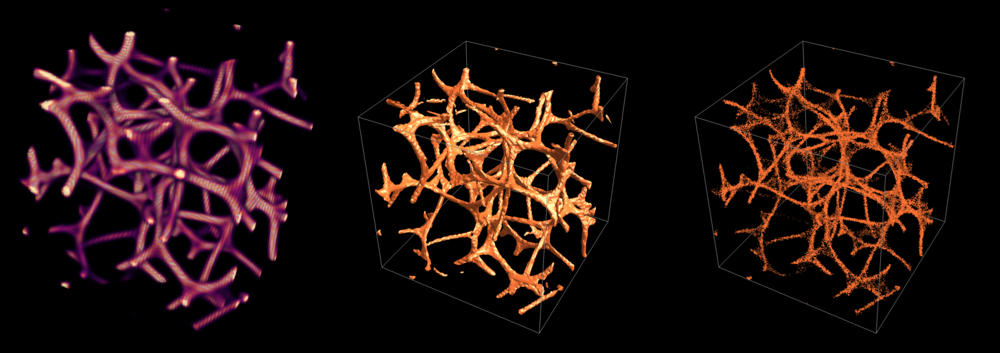
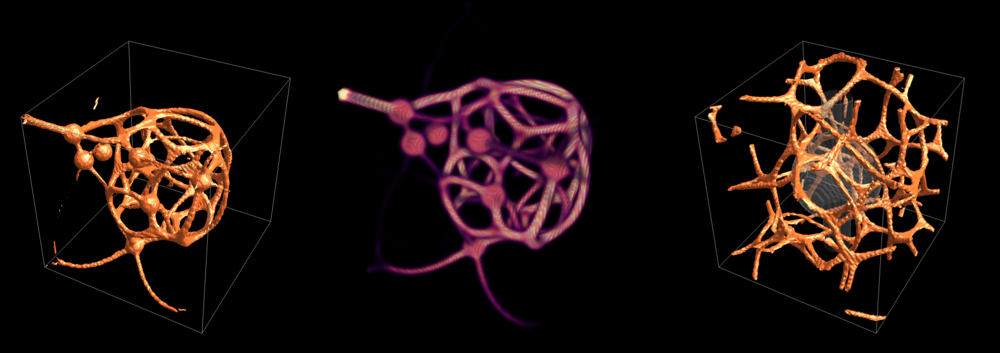

# PhysarumSimulation3D

Creates a new 3D slime-mould agent simulation: the same model as
[PhysarumSimulation](PhysarumSimulation.md), with agents moving through a volume instead of over a plane.

## Syntax

| Form | Meaning |
| --- | --- |
| `PhysarumSimulation3D[]` | a simulation with the `"Classic"` preset |
| `PhysarumSimulation3D["preset"]` | a simulation with a named preset from [$PhysarumPresets](PhysarumPresets.md) |
| `PhysarumSimulation3D[species]` | a simulation with one species, given as an Association of parameters |
| `PhysarumSimulation3D[{species1, species2, ...}]` | several competing species |
| `PhysarumSimulation3D[<\|"Species" -> {...}, ...\|>]` | a full specification, as for [PhysarumSimulation](PhysarumSimulation.md) |
| `PhysarumSimulation3D[spec, opts]` | with options |

## Details

* The result is a [PhysarumSimulation3DObject](PhysarumSimulation3DObject.md). Advance it with
  [PhysarumEvolve](PhysarumEvolve.md) and draw it with [PhysarumImage3D](PhysarumImage3D.md) or
  [PhysarumGraphics3D](PhysarumGraphics3D.md). [PhysarumArt3D](PhysarumArt3D.md) does all three in one call.
* Specifications, presets and species parameters are the same as in 2D, and mean the same thing.
  `"AgentDensity"` is agents per **voxel**, so a 96 × 96 × 96 grid with density 0.3 has about
  265,000 agents.
* **How a 3D agent senses.** Each agent has a heading in space, one sensor straight ahead, and a
  ring of four sensors tilted away from the heading by `"SensorAngle"`. The ring is turned by a
  random amount every step, so no direction in the grid is preferred. The agent goes straight on if
  the centre smells strongest, turns by `"RotationAngle"` towards the strongest ring sensor
  otherwise, and turns towards a random ring sensor if the centre smells weakest of all.
  `"Jitter"` tilts the heading by a random angle of up to `Jitter`/2 in a random direction.
* The trail diffuses over the 3 × 3 × 3 neighbourhood of each voxel.
* **Coordinates.** Food points and wall regions are given in the **unit cube**: `{0, 0, 0}` is the
  bottom front left corner and `{1, 1, 1}` the top back right, with *z pointing up*.
* **Masks** for `"Food"`, `"Walls"` and `"Initialization"` can be:
  * a 3D region or primitive (`Ball`, `Cuboid`, `Cylinder`, `Ellipsoid`, `ImplicitRegion`, ...) in
    unit-cube coordinates, or a list of them,
  * an `Image3D`, stretched over the grid,
  * a 3D array of values between 0 and 1, read as `Image3D[array]` would show it.
* Text and 2D graphics are not accepted as masks in 3D.
* Grids grow quickly with size: 128³ is 2.1 million voxels. The default size of 96 keeps the
  presets to a few seconds per 300 steps.
* `"Steps"` (used by [PhysarumArt3D](PhysarumArt3D.md)) is 300 for every preset unless the
  specification has a `"Steps3D"` key.

## Options

| Option | Default | Meaning |
| --- | --- | --- |
| `"Size"` | 96 | grid size in voxels. A number `n` gives an `n × n × n` grid, and `{w, h, d}` a box. |
| `"Agents"` | Automatic | exact number of agents. Automatic uses `AgentDensity × w × h × d`. |
| `"Initialization"` | Automatic | how agents are placed. Automatic uses the specification's value, or `"Random"`. |
| `"Food"` | None | food sources: points in the unit cube, or a mask |
| `"FoodStrength"` | Automatic | attractant added per step at full food intensity. Automatic is the largest species `"Deposit"`. |
| `"FoodRadius"` | 2 | radius in voxels of each food point. Applies to point input only. |
| `"Walls"` | None | impassable regions, as any mask |
| `"Wrap"` | Automatic | whether the grid is periodic in all three directions. Automatic is `True` unless food or walls are given. |

### Initialization

| Value | Agents start |
| --- | --- |
| `"Random"` | uniformly over the volume, with random headings |
| `"Ball"` | uniformly inside a ball in the middle of the grid (`"Disk"` also works) |
| `"Shell"` | on a sphere, heading inwards (`"Ring"` also works) |
| `"Burst"` | in a tiny ball in the centre, heading outwards |
| `"Food"` | placed over the food, in proportion to its intensity. Needs `"Food"`, else falls back to `"Random"`. |
| a mask | placed over the mask, in proportion to its value |

## Examples

### Grow and look

```wolfram
SeedRandom[1];
sim = PhysarumSimulation3D["Classic"];
sim = PhysarumEvolve[sim, 300];
{PhysarumImage3D[sim], PhysarumGraphics3D[sim], PhysarumGraphics3D[sim, Method -> "Points"]}
```



### Foraging in 3D

```wolfram
SeedRandom[5];
food = RandomReal[{0.15, 0.85}, {8, 3}];                (* points in the unit cube *)
sim = PhysarumEvolve[PhysarumSimulation3D["Classic", "Food" -> food, "FoodStrength" -> 50], 400];
PhysarumGraphics3D[sim]
```

### Walls

```wolfram
walls = {Ball[{0.5, 0.5, 0.5}, 0.25], Cylinder[{{0.5, 0.5, 0}, {0.5, 0.5, 1}}, 0.08]};
PhysarumGraphics3D[PhysarumEvolve[PhysarumSimulation3D["Classic", "Walls" -> walls, "Wrap" -> True], 300]]
```



### Competing species

```wolfram
PhysarumGraphics3D[PhysarumEvolve[PhysarumSimulation3D["Rivals", "Size" -> 80], 300]]
```

## Messages

| Message | Meaning |
| --- | --- |
| `PhysarumSimulation::spec` | the specification is not a preset name or valid species |
| `PhysarumSimulation3D::size` | `"Size"` is not a positive integer or a list of three |
| `PhysarumSimulation3D::mask` | a `"Food"`, `"Walls"` or `"Initialization"` value cannot be turned into a 3D mask |
| `PhysarumSimulation::nolib` | the compiled simulation library could not be loaded |

## See also

[PhysarumSimulation3DObject](PhysarumSimulation3DObject.md) ·
[PhysarumEvolve](PhysarumEvolve.md) ·
[PhysarumImage3D](PhysarumImage3D.md) ·
[PhysarumGraphics3D](PhysarumGraphics3D.md) ·
[PhysarumArt3D](PhysarumArt3D.md) ·
[PhysarumSimulation](PhysarumSimulation.md)
